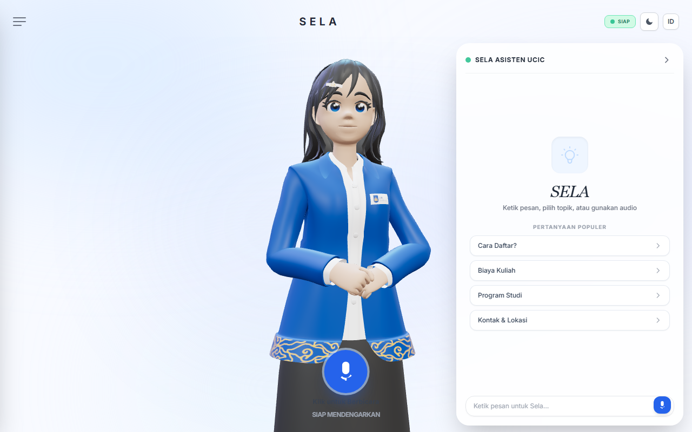
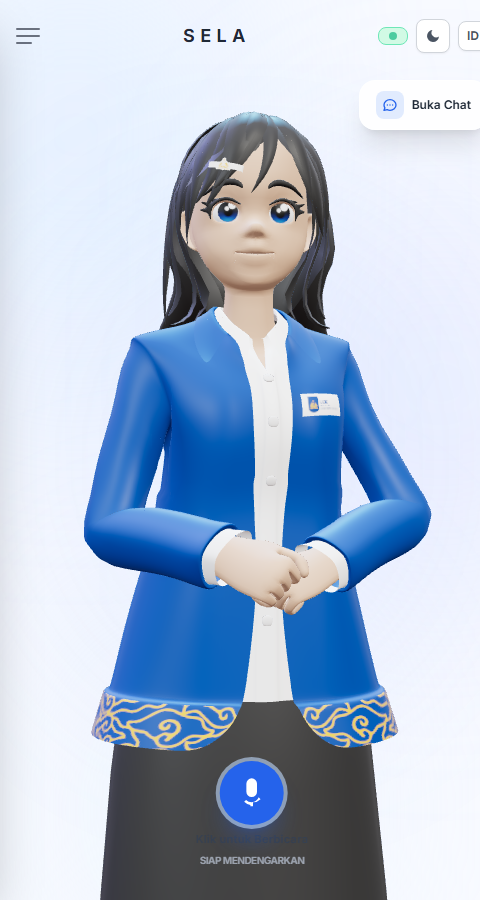
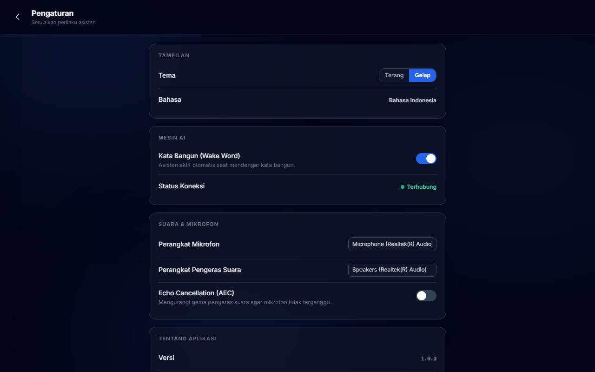
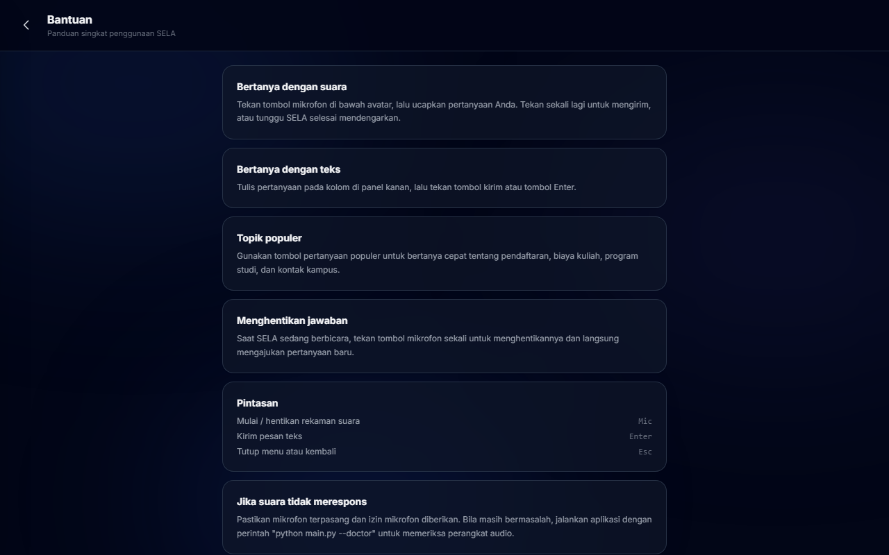
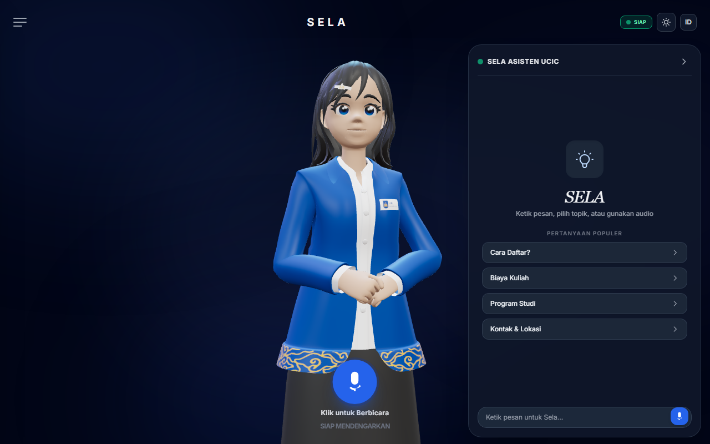

# SELA AI

**Asisten kampus berbasis suara** untuk Universitas Catur Insan Cendekia (UCIC).
Antarmuka modern bergaya kios (potret & desktop) di atas mesin AI
[py-xiaozhi](https://github.com/huangjunsen0406/py-xiaozhi) yang sudah teruji.

> Dibuat untuk dipasang pada **Raspberry Pi 4B (RAM 2 GB)**, juga berjalan di
> **Windows**, **Linux**, dan **macOS**.

## Tampilan

| Desktop | Potret (kios) |
| --- | --- |
|  |  |

| Pengaturan | Bantuan |
| --- | --- |
|  |  |

Hasil paket `.exe` (dijalankan dari `dist/sela-ai/`):



---

## Daftar isi

1. [Fitur](#fitur)
2. [Arsitektur](#arsitektur)
3. [Menjalankan cepat](#menjalankan-cepat)
4. [Mode tampilan](#mode-tampilan)
5. [Pemeriksaan lingkungan (`--doctor`)](#pemeriksaan-lingkungan---doctor)
6. [Membangun paket instalasi (.exe / .deb / .dmg)](#membangun-paket-instalasi)
7. [Pemecahan masalah](#pemecahan-masalah)
8. [Struktur proyek](#struktur-proyek)
9. [Dokumen lain](#dokumen-lain)

---

## Fitur

| Fitur | Keterangan |
| --- | --- |
| **Antarmuka kios modern** | Desain kartu kaca (glassmorphism), tata letak potret **dan** desktop |
| **Avatar 3D + lipsync** | Model `sela.glb` dengan animasi (Idle/Talking/Thinking/Greeting/…) dan mulut yang bergerak mengikuti suara asli |
| **Bahasa Indonesia penuh** | Seluruh tombol, judul, dan pesan dalam Bahasa Indonesia |
| **Suara dua arah** | Mikrofon → teks, jawaban → suara, dengan tombol besar di tengah layar |
| **Panel percakapan** | Riwayat sesi, pertanyaan populer, kirim teks, sembunyikan/tampilkan panel |
| **Pengaturan nyata** | Tema, perangkat mikrofon/pengeras suara, kata bangun, echo cancellation — tersimpan ke konfigurasi mesin AI |
| **Bantuan terintegrasi** | Panduan penggunaan dan pemecahan masalah di dalam aplikasi |
| **Tetap satu mesin AI** | Seluruh kecerdasan ada di py-xiaozhi; antarmuka hanya tampilan |

---

## Arsitektur

```
┌──────────────────────────────────────────────────────────────┐
│  Peramban / jendela native  (antarmuka SELA)                 │
│  React + Three.js  ·  webui/                                 │
└───────────────▲───────────────────────────┬──────────────────┘
                │ WebSocket /ws             │ HTTP /api/*
                │ (status, teks, lipsync)   │ (config, devices)
┌───────────────┴───────────────────────────▼──────────────────┐
│  Server lokal (aiohttp)   src/ui/web/server.py               │
│  Jembatan EventBus        src/ui/web/bridge.py               │
└───────────────▲───────────────────────────┬──────────────────┘
                │ EventBus (sama seperti QML)│
┌───────────────┴───────────────────────────▼──────────────────┐
│  MESIN AI py-xiaozhi (tidak diubah)                          │
│  Protocol (WebSocket/MQTT) · Audio (Opus/AEC) · MCP · Wake   │
└──────────────────────────────────────────────────────────────┘
```

Antarmuka web hanyalah **ViewPort tambahan**. Mode `gui` (QML), `cli`, `tui`,
dan `gpio` tetap ada dan berfungsi seperti semula — tidak ada fungsi yang
dihapus. Detail lengkap ada di [`docs/ARSITEKTUR.md`](docs/ARSITEKTUR.md).

---

## Menjalankan cepat

### Windows

```bat
run_windows.bat
```

### Linux / Raspberry Pi

```bash
bash run_linux.sh
```

### macOS

```bash
bash run_macos.command
```

Skrip di atas menyiapkan semuanya sekali (membangun antarmuka web, membuat
virtual environment, memasang dependensi), lalu membuka aplikasi.

### Menjalankan manual

```bash
# 1. Bangun antarmuka web (sekali saja)
cd webui
npm install
npm run build
cd ..

# 2. Pasang dependensi Python
python -m venv .venv
.venv/bin/pip install -r requirements.txt      # Windows: .venv\Scripts\pip

# 3. Jalankan
.venv/bin/python main.py
```

Aplikasi akan membuka `http://127.0.0.1:8765/` di peramban.

---

## Mode tampilan

| Perintah | Kegunaan |
| --- | --- |
| `python main.py` | Antarmuka web, jendela desktop (default) |
| `python main.py --portrait` | Tata letak **potret** (kios layar sentuh 7") |
| `python main.py --kiosk` | **Layar penuh tanpa bingkai** (mode pameran) |
| `python main.py --portrait --kiosk` | Kombinasi untuk Raspberry Pi + layar potret |
| `python main.py --doctor` | Periksa lingkungan lalu keluar |
| `python main.py --mode cli` | Antarmuka terminal (hemat daya, cocok untuk SSH) |
| `python main.py --mode gui` | Antarmuka QML lama (butuh `PySide6`) |
| `python main.py --mode gpio` | Tombol fisik (khusus Linux / Raspberry Pi) |

### Membuka halaman langsung lewat URL

Berguna untuk kios: petugas bisa membuka halaman tertentu tanpa mengklik menu.

```
http://127.0.0.1:8765/?halaman=pengaturan
http://127.0.0.1:8765/?halaman=bantuan
```

### Variabel lingkungan penting

| Variabel | Bawaan | Keterangan |
| --- | --- | --- |
| `SELA_WEBUI_PORT` | `8765` | Port server antarmuka lokal |
| `SELA_PORTRAIT` | `0` | `1` = ukuran jendela potret |
| `SELA_KIOSK` | `0` | `1` = buka Chromium kios layar penuh |

---

## Pemeriksaan lingkungan (`--doctor`)

Ini alat pertama yang harus dijalankan bila ada masalah. Ia memeriksa satu per
satu titik yang paling sering membuat aplikasi gagal:

```bash
.venv/bin/python main.py --doctor      # Windows: .venv\Scripts\python main.py --doctor
```

Yang diperiksa: versi Python, paket wajib, hak tulis direktori data,
**library Opus**, AEC/webrtc_apm, **perangkat audio (mikrofon/pengeras suara)**,
konfigurasi & akun, antarmuka web, jaringan ke layanan AI, dan ketersediaan port.

Contoh keluaran:

```
[ OK ] Versi Python
        Python 3.11.9
[ OK ] Library Opus (wajib untuk suara)
        dimuat dari libs/libopus/linux/arm64/libopus.so
[ OK ] Perangkat audio
        3 input, 2 output | default in=1 out=2
```

Bila ada `[GAGAL]`, pesannya sudah berisi langkah perbaikan yang spesifik.

---

## Membangun paket instalasi

Semua skrip membangun antarmuka web terlebih dahulu, lalu menjalankan
`unifypy` (PyInstaller + alat installer platform).

| Platform | Perintah | Hasil |
| --- | --- | --- |
| Windows | `scripts\build_windows.bat` | `installer\sela-ai-1.0.0-x86_64.exe` ✅ sudah terbukti |
| Linux | `bash scripts/build_linux.sh` | `installer/sela-ai_1.0.0_amd64.deb` |
| macOS | `bash scripts/build_macos.sh` | `installer/sela-ai-1.0.0.dmg` |

Prasyarat tiap platform, termasuk paket sistem yang wajib dipasang, ada di
[`docs/BUILD.md`](docs/BUILD.md).

> **Raspberry Pi:** bangun `.deb` **langsung di Pi** (arsitektur arm64) agar
> paket cocok. Membangun di komputer x64 menghasilkan paket yang tidak jalan di Pi.

---

## Pemecahan masalah

Ringkasan masalah yang sudah diperbaiki beserta cara mengatasinya ada di
[`docs/PERBAIKAN.md`](docs/PERBAIKAN.md). Tiga yang paling sering:

**1. Windows: aplikasi tidak mau terbuka.**
Jalankan `run_windows.bat` (bukan `.exe` hasil build) — pesan galat akan terlihat
di jendela terminal. Sejak versi ini, setiap galat fatal juga ditulis ke
`%LOCALAPPDATA%\sela-ai\logs\crash-*.log` dan, pada versi terkemas, ditampilkan
lewat kotak dialog Windows. Penyebab paling umum: `PySide6` belum terpasang pada
mode `gui` — gunakan mode `web` (bawaan) yang tidak membutuhkannya.

**2. Linux: aplikasi terbuka tetapi suara tidak merespons.**
Jalankan `python main.py --doctor`. Penyebab tersering adalah library sistem
audio belum ada:

```bash
sudo apt install libportaudio2 portaudio19-dev libopus0
```

Pastikan juga pengguna tergabung dalam grup audio: `sudo usermod -aG audio $USER`
(lalu masuk ulang), dan layanan suara berjalan (`pulseaudio` / `pipewire`).

**3. Layar potret tidak rapi.**
Gunakan `--portrait` (atau `--portrait --kiosk`). Tata letak potret menaruh
avatar sebagai latar penuh dengan panel percakapan sebagai lembaran bawah.

---

## Struktur proyek

```
Sela-AI-V1.0/
├── main.py                  # Titik masuk (mode web/gui/cli/tui/gpio, --doctor)
├── build.json               # Konfigurasi paket instalasi
├── requirements.txt         # Dependensi Python
├── run_windows.bat          # Peluncur Windows
├── run_linux.sh             # Peluncur Linux / Raspberry Pi
├── run_macos.command        # Peluncur macOS
├── src/
│   ├── ui/
│   │   ├── web/             # ★ Antarmuka web SELA (server, jembatan, peluncur)
│   │   ├── gui/             # Antarmuka QML lama (tetap ada)
│   │   ├── cli/  tui/  gpio/
│   │   └── shared/          # ViewPort + factory
│   ├── audio_codecs/        # Opus + AEC + lipsync hook
│   ├── protocols/           # WebSocket / MQTT
│   ├── mcp/                 # Alat MCP (musik, kamera, cuaca, volume, …)
│   └── utils/
│       ├── diagnostics.py   # ★ Pemeriksaan lingkungan (--doctor)
│       └── opus_loader.py   # Pemuatan library Opus lintas platform
├── webui/                   # ★ Antarmuka React (sumber + hasil build)
│   ├── src/components/      # Avatar3D, ChatPanel, Navbar, Settings, …
│   ├── src/lib/             # bridge.js, useSelaBridge.js, translations.js
│   └── public/models/sela.glb
├── libs/                    # Opus & AEC untuk win/mac/linux (x64 & arm64)
├── scripts/                 # Skrip build (.exe/.deb/.dmg) + utilitas
└── docs/                    # Dokumentasi Bahasa Indonesia
```

---

## Bahasa jawaban SELA

Antarmuka aplikasi (web, CLI, TUI) **seluruhnya Bahasa Indonesia**.

Namun **bahasa jawaban model AI ditentukan di sisi server**, bukan di aplikasi.
Aplikasi hanya mengirim sinyal bahasa (`Accept-Language: id-ID` pada request OTA
dan koneksi WebSocket); model bahasa yang menyusun jawaban berjalan di server
xiaozhi.

Agar SELA menjawab dalam Bahasa Indonesia, atur **prompt/agent** pada akun
xiaozhi Anda agar berbahasa Indonesia, atau arahkan aplikasi ke server xiaozhi
buatan sendiri dengan prompt Indonesia. Caranya: ubah
`SYSTEM_OPTIONS.NETWORK.WEBSOCKET_URL` pada berkas konfigurasi.

## Status verifikasi

| Diperiksa | Hasil |
| --- | --- |
| `--doctor` | **11/11 lolos** (di lingkungan pengembangan dan di aplikasi hasil paket) |
| Uji otomatis | **111 lolos, 3 dilewati** (3 lewat = uji QML, `PySide6` opsional) |
| Aplikasi dari sumber | Berjalan; melayani UI + `/api/*` + model 3D |
| Paket PyInstaller (`.exe`) | **Berhasil dibangun & dijalankan**; seluruh aset (UI, model 3D, Opus/AEC, model kata bangun) ikut terbundel; `--doctor` 11/11 |
| **Installer Windows (`.exe`)** | **Berhasil dibangun** — `installer/sela-ai-1.0.0-x86_64.exe` (122,6 MB), PE valid |
| Tampilan | Desktop, potret, pengaturan, bantuan — lihat tangkapan layar di atas |
| Suara aktivasi | Locale **`id-ID`**; `activation.wav` + `0..9.wav` Indonesia terverifikasi ada & berisi audio |
| Bahasa antarmuka | Web UI, CLI, dan TUI bebas aksara Mandarin (dikunci oleh uji otomatis) |
| Audio nyata (mikrofon → jawaban) | **Belum diuji** — perlu perangkat Anda |
| Aktivasi akun | **Belum diuji** — perlu akun layanan AI |
| Installer Linux (`.deb`) / macOS (`.dmg`) | **Belum dijalankan** — harus dibangun di Linux / macOS masing-masing (lihat `docs/BUILD.md`) |

Jalankan `--doctor` lebih dulu di setiap perangkat target; laporannya akan
langsung menunjukkan bagian yang belum siap.

---

## Dokumen lain

- [`docs/INSTALASI.md`](docs/INSTALASI.md) — pemasangan di Windows / Linux / Raspberry Pi / macOS
- [`docs/BUILD.md`](docs/BUILD.md) — membangun `.exe`, `.deb`, `.dmg` selangkah demi selangkah
- [`docs/PERBAIKAN.md`](docs/PERBAIKAN.md) — akar masalah & perbaikan Windows/Linux/macOS
- [`docs/ARSITEKTUR.md`](docs/ARSITEKTUR.md) — cara kerja jembatan antarmuka ↔ mesin AI
- [`docs/PENGUJIAN.md`](docs/PENGUJIAN.md) — daftar periksa pengujian sebelum dipasang

---

## Lisensi

MIT. Mesin AI berasal dari
[py-xiaozhi](https://github.com/huangjunsen0406/py-xiaozhi) (MIT).
